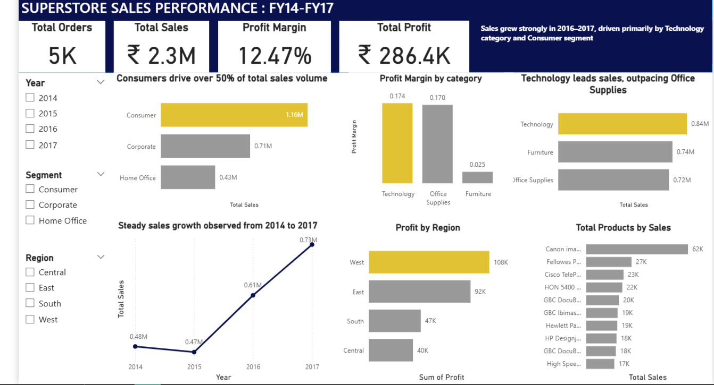

# Superstore Sales Analytics Pipeline

## Overview

This project builds an end-to-end sales analytics solution using MySQL and Power BI. The objective is to transform raw transactional data into a structured analytical model and deliver business insights through an interactive executive dashboard.

The pipeline demonstrates practical skills in data engineering, dimensional modeling, and business intelligence that are directly relevant to data analyst and analytics consulting roles.

---

## Business Objective

Retail organizations generate large volumes of transactional data but often lack a structured system to analyze performance drivers.

This project answers key business questions:

* How are sales and profits trending over time?
* Which customer segments drive the most revenue?
* Which product categories and products perform best?
* How does profitability vary across regions?

---

## Architecture

```
Raw CSV → Staging Table → Dimension Tables → Fact Table → Analytics View → Power BI Dashboard
```

### Pipeline Flow

1. Raw Superstore CSV ingested into MySQL staging table
2. Data transformed into a star schema (dimensions + fact)
3. Analytics view created for BI consumption
4. Power BI dashboard built for executive insights

---

## Tech Stack

* MySQL — data warehouse and transformations
* SQL — data modeling and ETL
* Power BI — dashboard and visualization
* PyCharm — development environment
* CSV — source data

---

## Data Model

A star schema was implemented to support efficient analytical queries.

### Fact Table

**fact_sales** — contains transactional metrics:

* Sales
* Profit
* Quantity
* Discount

### Dimension Tables

* **dim_customer**
* **dim_product**
* **dim_region**
* **dim_date**

This design improves query performance, reduces redundancy, and supports scalable analytics.

---

## Project Structure

```
sales_analytics_pipeline/
│
├── data/
│   ├── raw/
│   └── processed/
│
├── docs/
│   ├── business_questions.md
│   └── data_model.md
│
├── etl/
│   ├── create_database.ipynb
│   ├── data_exploration.ipynb
│   ├── data_quality.ipynb
│   └── load_staging.ipynb
│
├── sql/
│   ├── 01_create_staging.sql
│   ├── 02_create_dimensions.sql
│   ├── 03_create_fact_sales.sql
│   ├── 04_load_fact_sales.sql
│   └── 05_business_queries.sql
│
├── powerbi/
│   └── Superstore EY.pbix
│
├── requirements.txt
└── README.md
```

---

## Key Features

* End-to-end ETL pipeline in MySQL
* Indexed staging layer for faster joins
* Clean star schema implementation
* Reusable analytics view for BI tools
* Interactive Power BI executive dashboard
* Business-focused insight annotations

---

## Dashboard Highlights

The Power BI dashboard provides:

* KPI summary (Sales, Profit, Orders, Margin)
* Sales trend analysis (FY14–FY17)
* Segment performance comparison
* Category-wise sales distribution
* Regional profitability analysis
* Top-performing products ranking
## Dashboard Preview



---

## How to Run the Project

### 1. Load Data to MySQL

* Run notebooks in the **etl/** folder to explore and load the staging table.
* Execute SQL scripts in order:

  1. `01_create_staging.sql`
  2. `02_create_dimensions.sql`
  3. `03_create_fact_sales.sql`
  4. `04_load_fact_sales.sql`
  5. `05_business_queries.sql`

### 2. Open Power BI Dashboard

* Open `powerbi/Superstore EY.pbix`
* Refresh the dataset connection to MySQL
* Interact with filters and visuals

---

## Future Improvements

* Convert notebooks to production-grade Python scripts
* Add incremental loading logic
* Implement data validation tests
* Deploy to a cloud data platform (Azure/AWS/GCP)

---

## Author

**Adil O**
Data Analyst | AI & Data Enthusiast
GitHub: [https://github.com/adilovungal](https://github.com/adilovungal)

---

This project was built as part of hands-on preparation for data analyst and analytics consulting roles, focusing on real-world data modeling and business insight generation.
